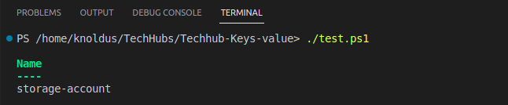

# Short Description about this template
This powershell script helps you get the particular Key value from the JSON file

In this techhub we can see when  passing the  key name resourceType then it return the value. 

# Steps for Execution 
1. clone the repository  
2. ./test.ps1

As you can see in the below image this will return the key resourceType value.

